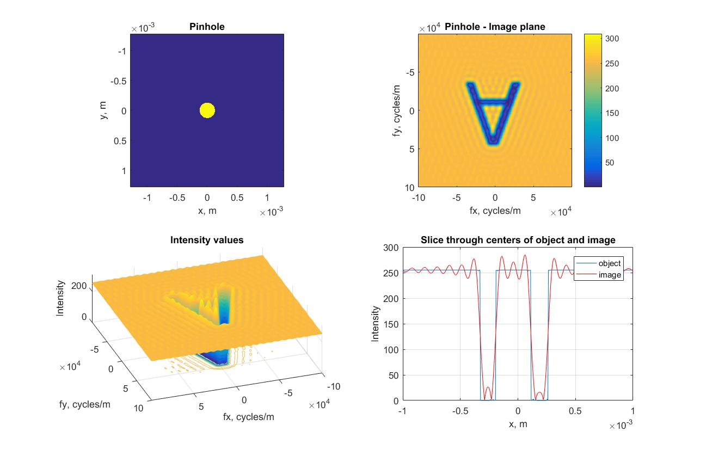
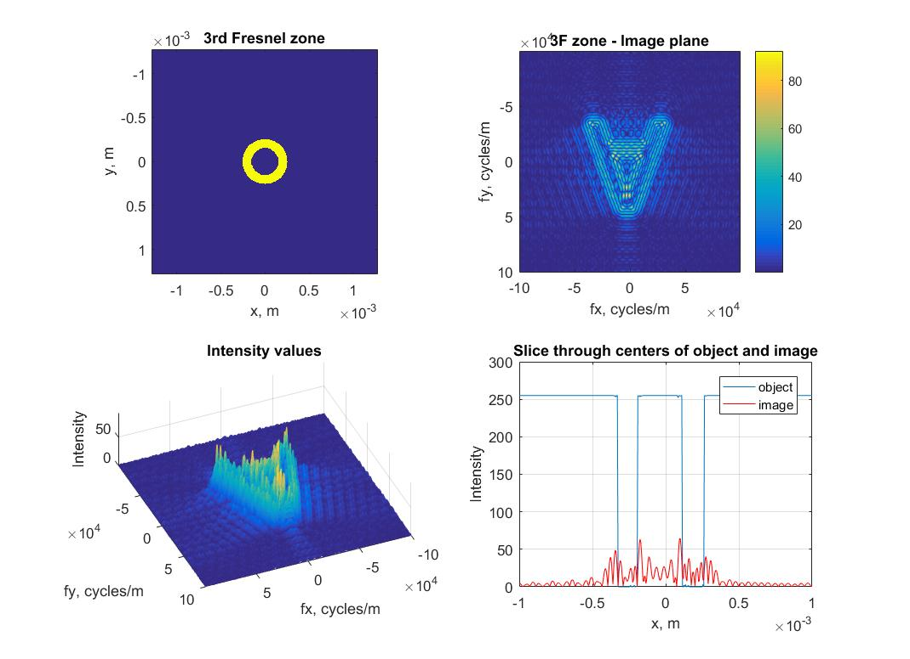

# 4F Optical Correlator Simulation

 >*A Matlab simulation for a 4F Correlator system which is based on the Fourier transforming properties of lenses. Aliaksei Petsiuk, 2019*
  

The 4F Optical Correlator system is based on the Fourier transforming properties of lenses. According to the Diffraction theory, a convex lens of focal length f will produce the Fourier transform at a distance f behind the lens of an object placed at f distance in front of the lens. These properties give us an opportunity to implement direct and inverse Fourier transforms of two-dimensional objects and modify and analyze their spatial frequency spectra.   

   
**Figure 0.** Model of the experiment
    

### Matlab Setup
An input is a transparent image of a black letter "A". Matlab simulation was performed for the following filter parameters:

| Parameter        | Value           |
| ------------- |:-------------:|
| Pinhole diameter      | 255 microns |
| Band-pass filter      | 500 microns/300 microns      |
| Slit long side | 800 microns      |
| Slits short side | 120 microns |
| Spacing between centers of the slits | 300 microns |
    

### Simulation Results

   
**Figure 1.** No Filter
    

   
**Figure 2.** Pinhole
    

   
**Figure 3.** Horizontal Single Slit
    

   
**Figure 4.** Horizontal Double Slit
    

   
**Figure 5.** Vertical Single Slit
    

   
**Figure 6.** Vertical Double Slit
    

   
**Figure 7.** Fresnel Zone
    

   
**Figure 8.** Mesh
    

*Aliaksei Petsiuk, 2019*   
&mdash; end &mdash;

